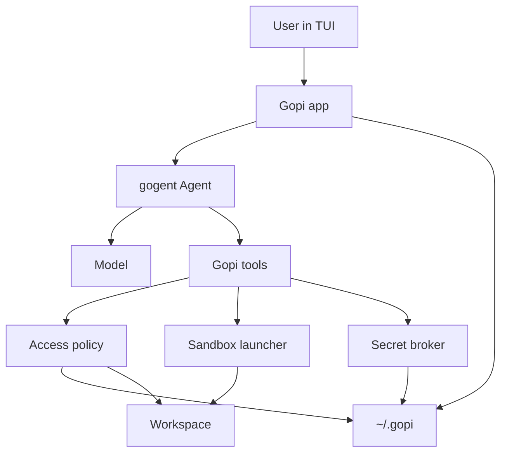
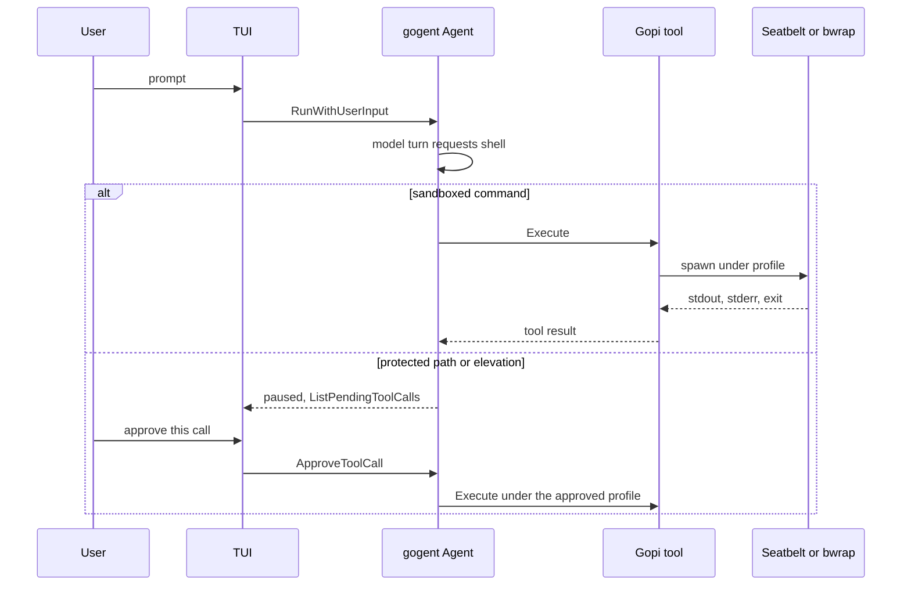

# Architecture

Gopi is a personal coding agent: a terminal UI over [gogent](https://github.com/cgund98/gogent), with tools that read and edit a workspace, run a shell, and delegate work to subagents.

Gogent owns the conversation loop, tool-call transcript, and human-in-the-loop pause. Gopi owns everything the loop calls into: the system prompt, tool implementations, sandbox, secrets, and configuration. Sandbox and policy code stays in gopi. The gogent loop stays orchestration-only.

The design follows the same split used by Codex, Claude Code, and Cursor:

| Layer | What it decides | Who enforces it |
|-------|-----------------|-----------------|
| Instructions | What the model is told to do | System prompt, `AGENTS.md`, skills |
| Tool policy | Whether this call may run, and whether a person must approve it | `RequiresApproval(ctx, args)` plus gopi policy |
| Sandbox | What a process can actually touch once it is running | OS: Seatbelt on macOS, bubblewrap on Linux |
| Secret broker | Which credentials exist, and that the model never sees their values | Host process only |

Tool policy without a sandbox is not a security boundary. Cursor's own ignore rules block the built-in file tools and still leave the terminal free to `cat` the same path. Codex and Claude Code close that gap by applying the restriction to the whole process tree. Gopi does the same: ignore rules are input to the sandbox profile, not only a check inside `read_file`.

## Principles

- **Fail closed.** If the sandbox cannot be applied, the command does not run. A warning plus an unsandboxed fallback is a bypass.
- **Deny wins.** A project config, skill, or `AGENTS.md` can narrow permissions. It cannot widen the user's security floor (protected paths, secret scrubbing, metadata-address blocks, approval for elevation).
- **Approval is per call.** Protected files and privilege elevation are approved once, for that tool call, and then forgotten. Session allowlists are a later convenience for ordinary sandboxed commands, and they never cover protected paths.
- **The model is untrusted.** File contents, web pages, tool output, skills, and `AGENTS.md` inside a repository are data. They do not grant capabilities.
- **Secrets stay in the host.** The user toggles env names on an elevation card. The host injects those values into the child environment. The value is not a tool argument, a prompt field, or a log line.
- **macOS first.** The workstation is macOS. Linux uses the same policy types with a different enforcer. Windows is out of scope.

## System overview



One gopi process is the host. It holds the API key, the secret broker, the policy, and the gogent agent. Tool processes are children. They receive a scrubbed environment and a sandbox profile computed for that call.



## Proposed layout

| Path | Responsibility |
|------|----------------|
| `gopi` | Public library: `Run`, `WithWorkspace`, and `WithTool` |
| `cmd/gopi` | Built binary. Calls `gopi.Run` with the built-in tools |
| `internal/app` | Session wiring: config, prompt, registry, agent, store |
| `internal/tui` | Bubble Tea UI. Approval cards follow `gogent/examples/tui` |
| `internal/config` | `~/.gopi` and project `.gopi` loading, precedence, security floor |
| `internal/prompt` | System prompt assembly, `AGENTS.md` discovery, skill catalog |
| `internal/policy` | Ignore matching, protected paths, network allow and deny |
| `internal/sandbox` | `Launcher` interface, macOS Seatbelt, Linux bubblewrap |
| `internal/secrets` | Load, inject by name, redact tool output and logs |
| `internal/tools` | Tool implementations registered on a `*gogent.ToolRegistry` |
| `internal/session` | Chat persistence and redacted audit log |

Gopi depends on gogent as a library. Provider wire format stays in gogent's `openai` package. Gopi passes a composed system prompt through `openai.NewChat(...).WithSystemPrompt(...)`.

## Runtime components

### Agent session

A session is one workspace plus one gogent chat:

- `Model` — built with the composed system prompt and the session's tool registry.
- `MessageStore` — transcript for this chat. In-memory is enough for the first milestone; a store under `~/.gopi/sessions/` comes later.
- `ToolRegistry` — pointer shared with the agent, matching gogent's registration rules.
- `ChatEventBroadcaster` — drives TUI updates (`message_added`, `message_updated`).
- `Policy` and `Sandbox` — request-scoped values the tools close over. They are not gogent types.

`maxIterations` caps model turns. Tool resolution does not count toward that cap, so a paused approval does not burn the budget. Subagents get their own agent, store, and a lower cap.

### Tool surface

| Tool | When it pauses | Sandbox | Purpose |
|------|----------------|---------|---------|
| `read_file`, `list_dir`, `grep` | Protected path only | Host-side policy check, no shell | Read workspace files |
| `write_file`, `edit_file` | Protected path, or a write outside the write root | Host-side policy check | Edit files |
| `shell` | Only when `profile` is wider than the default sandbox | Profile from the arguments, secret-scrubbed | Run a command |
| `web_search` | No | Host-side request to the configured search endpoint. No socket inside `shell` | Look up a query on the internet |
| `delegate` | No | Child policy is a subset of the parent | Subagent |

`shell` takes a `profile` argument that defaults to `sandbox` (workspace write root, protected paths denied, network `deny` or the user allowlist). A wider profile is the elevation request. There is no second tool and no boolean that disables the sandbox inside an already-approved call. Claude Code's `dangerouslyDisableSandbox` retry is the pattern this avoids: a prompt-injected model can ask for `profile: unsandboxed`, and that ask is a fresh approval card.

A shell string cannot be classified reliably (`bash -c`, interpreters, indirection). The sandbox still denies protected paths and disallowed network even when `profile` is `sandbox` and the call auto-runs. If that command fails closed, the model asks again with an explicit wider profile, or it calls `read_file` on the protected path, which pauses on its own.

File tools and `shell` share one `policy.Engine`. An `access_denied` result names the rule id and the path. It does not include file contents or a listing of neighboring secrets.

### Gogent change: `RequiresApproval` sees the call

`RequiresApproval()` takes no arguments, so every call to that tool gets the same answer. The tool struct can already hold a policy engine. What it cannot see is this call's arguments.

Change the method. Gogent is still pre-release, and the call sites are the agent loop, `ListPendingToolCalls`, and the examples.

```go
type ApprovalDecision struct {
    Required bool
    Reason   string // workflow field for the UI; not sent to the model
}

RequiresApproval(ctx context.Context, args json.RawMessage) (ApprovalDecision, error)
```

`shell` holds `*policy.Engine` on the struct. `RequiresApproval` parses `args`, returns `Required: false` for the default sandbox profile, and `Required: true` plus a reason when the profile is wider or a file tool targets a protected path. A tool that is always or never approved ignores `args` and returns a constant.

`processToolCalls` and `ListPendingToolCalls` pass the call's `Args`. The method runs only while the call is still pending, and it must be free of side effects. After `ApproveToolCall`, execution proceeds as it does today. Persist `Reason` on `ToolCall` at pause time and return it from `ListPendingToolCalls`, so the card does not depend on a second policy evaluation. The OpenAI adapter already drops gogent-only `ToolCall` fields; `Reason` joins that set. A returned error fails the call with `execution_failed` and does not treat it as approval.

That is the only gogent change this design depends on. Nested agents, streaming, and a system-prompt API stay out of the library: `delegate` builds a second `Agent`, the system prompt stays on `WithSystemPrompt`, and a child's `shell` returns `Required: false` for the sandbox profile and fails a wider profile inside `Execute`, so the child never pauses. Approvals stay on the user-facing agent.

### Workspace trust

Opening a directory asks once whether to trust it. The answer is stored in `~/.gopi`, keyed by the canonical repo root, not inside the repo.

| Mode | Behavior |
|------|----------|
| Untrusted | Sandboxed read-only tools. Project `AGENTS.md`, project skills, and project `.gopi/config.toml` are not loaded. |
| Trusted | Project instructions and skills load. Writes stay inside the workspace write root. Protected paths still need per-call approval. |

A cloned repository is untrusted data until that prompt is answered. Trust can be revoked.

## Sandbox

The sandbox is a `Launcher` with one method: run `argv` in `dir` under a `Profile`, and return stdout, stderr, and the exit code. The profile is computed in the host. The child cannot widen it.

```text
Profile
  read_roots      []path
  write_roots     []path
  deny_read       []path or pattern
  deny_write      []path or pattern
  network         deny | allowlist | unrestricted
  allow_domains   []host
  env             scrubbed map
  timeout
  output_limit
```

`network: unrestricted` is a `shell` profile that always requires approval. The default profile uses `deny` or `allowlist`.

### macOS (first)

Enforce with Seatbelt through `/usr/bin/sandbox-exec` and a profile generated per command. Codex and Claude Code use the same primitive. Apple marks `sandbox-exec` deprecated; the `Profile` type stays independent of Seatbelt syntax so the launcher can be replaced without rewriting tools.

The generated profile:

- Allows read of the workspace and a small set of system paths the dynamic linker and the shell need (`/usr`, `/bin`, `/opt/homebrew`, `/dev/null`, and the user's selected toolchain roots).
- Allows write only under the workspace write root and a session temp directory. `/tmp` is private to the command where the profile can express that, so a sandboxed command cannot rendezvous with an unsandboxed process through a shared temp file.
- Denies read and write of protected paths with rules placed so they match before the workspace allow. Seatbelt is ordered; a workspace-wide allow that is evaluated first would hide the deny.
- Denies writes to paths that stay protected even when the workspace is writable: `.git/config`, `.git/hooks`, `.git/info/attributes`, `.gopi/**`, ignore files, and the gopi binary's own install path.
- Denies `network*` except the localhost proxy port when `network` is `allowlist`. When `network` is `deny`, all outbound network is denied, including raw sockets, so a binary that ignores `HTTP_PROXY` still fails.
- Denies process debugging (`task_for_pid`, `ptrace`) and Apple events that would drive other apps.
- Clears `DYLD_INSERT_LIBRARIES`, `DYLD_LIBRARY_PATH`, and any secret-bearing variables before `exec`.

`sandbox-exec` applies to the child and to children it spawns. The host process is not sandboxed; it is the trust root.

### Linux

Enforce with bubblewrap (`bwrap`):

- `--ro-bind / /`, then `--bind` only the write roots.
- Re-apply read-only or inaccessible mounts for protected paths after the write bind, so a nested `.env` stays hidden inside a writable repo. This is the same "more specific mount wins" approach Codex uses for `.git`.
- `--unshare-user`, `--unshare-pid`, `--die-with-parent`, and `PR_SET_NO_NEW_PRIVS`.
- `--unshare-net` when `network` is `deny`.
- When `network` is `allowlist`, `--unshare-net` plus a pre-opened path to the host proxy (see Network). New `AF_UNIX` sockets are blocked after the proxy path exists, so the child cannot talk to `docker.sock`, the ssh-agent, or a user bus unless the profile explicitly bind-mounts one.
- Seccomp filter that rejects `ptrace`, `personality`, and adding capabilities.

Prefer system `bwrap` on `PATH` when it is outside the workspace, so a repo-local `bwrap` cannot replace the sandbox. If user namespaces are unavailable (typical of restricted containers and some Ubuntu AppArmor defaults), refuse the command. Landlock alone is not the Linux sandbox: it does not govern the network.

### Paths

Every path is canonicalized in the host before it is placed in a profile or opened by a file tool:

- `EvalSymlinks` plus `filepath.Abs`.
- Reject `..` after cleaning.
- On macOS, treat `/tmp` and `/private/tmp`, and `/var` and `/private/var`, as the same directory.
- Compare with the platform's case rules. APFS is often case-insensitive; a deny on `.env` must cover `.ENV`.
- A symlink inside the write root whose target is outside the root is not a write, and it is not a read if the target is protected. Tests cover this case explicitly. Structured tools open the canonical path. The shell sandbox denies the protected target, so the symlink does not become a readable alias.

Ignore matching uses a gitignore evaluator (directory prefix, `**`, negation, `git/info/exclude`), not a hand-rolled regex, for structured tools. Shell deny rules are a translation of that same set:

- Built-in secret globs become Seatbelt regexes or bubblewrap hidden mounts and apply to files created during the command.
- Gitignore patterns that translate cleanly become the same kind of rule.
- A pattern that cannot be translated fails closed for a `sandbox` profile: the command is refused with `access_denied` rather than run with a hole. The model can ask again with a wider `profile`, which pauses for approval.

Checking a path and then spawning is racy if the file is swapped for a symlink. The OS deny rule is the control that still holds after the spawn. The host check exists so the model gets a clean error instead of an `EPERM` it will try to route around.

## Filesystem policy

### Write root

The default write root is the trusted workspace. Reads outside it are limited to paths required to run compilers and interpreters. Home-directory reads are not implied by "read the repo". `~/.ssh`, `~/.aws`, `~/.config`, shell rc files, and `~/.gopi` are outside the read root unless a specific tool call is approved.

### Protected paths

A protected path is unreadable and unwritable until the user approves that access for that call. Protection is the union of:

1. **Security floor**, compiled into gopi, not configurable off:
   - `~/.gopi/secrets/**`, `~/.gopi/config.toml` credential fields
   - `~/.ssh/**`, `~/.aws/**`, `~/.kube/**`, `~/.gnupg/**`, `~/Library/Keychains/**`
   - `**/.env`, `**/.env.*`, `**/*.pem`, `**/*.key`, `**/id_rsa`, `**/id_ed25519`, `**/credentials.json`, `**/secrets.json`
   - Cloud metadata addresses (network floor; listed here because the same threat shows up as a file fetch)
2. **Global user rules** in `~/.gopi/ignore`. Gitignore syntax, plus an optional `regex` list for names gitignore cannot express.
3. **Repo rules**: `.gitignore`, `.git/info/exclude`, and a project ignore file if present.

Negation in a repo `.gitignore` cannot re-include a security-floor path. A project may ignore additional files. It may not un-ignore `.env`.

`read_file` returns protected bytes only after `RequiresApproval` pauses and the user approves that call. The host canonicalizes the path, stores the matched rule as `ApprovalDecision.Reason`, reads that file only, and redacts other known secret values inside it before the body is appended to the transcript. A `shell` card whose profile would let the command read the same file says so; the narrower grant is approving the `read_file` call.

Writes to protected paths use the same per-call approval. A sandboxed `shell` cannot create a hook at `.git/hooks/pre-commit` or rewrite `.gitignore` to drop `.env` from the denylist. Those paths are `deny_write` in every non-elevated profile.

## Network

Non-HITL calls (`shell`, structured tools, subagents) do not get general network access.

| Mode | Who | Behavior |
|------|-----|----------|
| `deny` | Default for `shell` | No outbound sockets. Package installs and `git fetch` fail and must be elevated or allowlisted. |
| `allowlist` | User config in `~/.gopi/config.toml` | Traffic to named hosts only, through a local proxy. |
| `unrestricted` | `shell` profile, approval required | Full network for that command, after approval. Secret scrubbing still applies. |

Allowlist enforcement matches Claude Code's proxy split, because Seatbelt and a network namespace can block destinations but cannot filter by HTTP hostname on their own:

1. The host listens on a loopback HTTP CONNECT proxy and, if needed for non-HTTP tools, a SOCKS5 proxy.
2. The child receives `HTTP_PROXY`, `HTTPS_PROXY`, `ALL_PROXY`, and `NO_PROXY=`. Git and common CLIs are pointed at the same proxy.
3. The OS profile denies every outbound address except that loopback port. Clients that ignore the proxy variables fail closed.
4. The proxy allows a connection only when the requested host matches the allowlist and the resolved addresses are not in the deny set.

Deny set, applied even when a domain is allowlisted (DNS rebinding and redirect protection):

- Loopback other than the proxy itself (`127.0.0.0/8`, `::1`)
- RFC1918, link-local, CGNAT (`10/8`, `172.16/12`, `192.168/16`, `169.254/16`, `100.64/10`, `fc00::/7`, `fe80::/10`)
- Cloud metadata (`169.254.169.254`, `fd00:ec2::254`, and the hostnames cloud vendors document)
- Unique-local and multicast

The proxy resolves the name and checks the address at connect time, then again if it follows a redirect. Domain patterns are hostnames only; URL paths are ignored. A user deny entry beats a user allow entry.

DNS exfiltration is in scope. In `deny` mode the child has no DNS. In `allowlist` mode the child uses the proxy, and the profile does not grant a general DNS server.

Raw elevated network is how a model would send a secret to an attacker-controlled host. Elevation cards show the command, the working directory, and the network delta (`deny -> unrestricted`). Prefer adding a host to the allowlist over unrestricted mode when the need is a single registry or git host.

## Privilege elevation

Elevation is a `shell` call whose `profile` is wider than `sandbox`. `RequiresApproval` returns `Required: true` and a reason the card renders in full:

| Profile | Grants | Still withheld |
|---------|--------|----------------|
| `workspace_network` | Sandbox stays; network becomes unrestricted or a named host list | Protected files, secret values, `.git` hooks and config |
| `extra_paths` | Named read or write roots, canonicalized and shown | Everything outside those roots; protected floor unless each path is also approved |
| `unsandboxed` | The user's uid, no Seatbelt or bwrap | Secret injection, unless the user toggles specific env names on |

The card shows argv as the user will run it, not a model summary, plus the stored `ApprovalDecision.Reason`. Approval of one call does not approve the next identical call. Each model request is a new `ToolCall`, and `RequiresApproval` runs again.

There is no allow-once-for-the-session flag on widened profiles or protected paths in the first milestones. If a session allowlist is added later for default `sandbox` commands, it stores a hash of argv plus cwd plus profile. `RequiresApproval` still requires approval whenever the profile is wider or a file tool targets a protected path.

Elevated commands keep the scrubbed environment. Passing a secret is a second, separate toggle on the card: a list of env **names** drawn from the broker. The values are inserted by the host after approval and are not written to the transcript.

## Secrets

`~/.gopi/secrets.toml` holds credential material. The file is mode `0600`. The model is never given this file as a read root.

The broker loads secrets into the host process at startup. Consumers:

- The model client reads the provider API key from the broker inside the host. The key is not copied into tool environments, transcripts, or the system prompt.
- A shell call receives a secret only when the elevation card toggles that env name. The value is copied into the child environment after approval.

Redaction runs on every tool result and every log line before persistence. It replaces:

- Any secret value currently loaded in the broker.
- Provider key prefixes and common token shapes (`sk-`, `github_pat_`, `AKIA`, PEM blocks).

Redaction is a backstop for accidental echoes. The primary control is that the child environment does not contain the values. A protected-file read the user approved can still place a secret into the transcript; the card says that before approval.

Crash dumps, Bubble Tea debug logs, and audit logs use the same redactor. `gopi` refuses to start if `~/.gopi` is group- or world-readable.

## Subagents

`delegate` starts a child gogent agent and returns its final assistant message to the parent.

The child receives:

- A fresh `MessageStore` and its own iteration budget and timeout.
- The parent system prompt plus the task string. The task string is user-visible in the parent transcript.
- A tool registry that is a subset of the parent's: `read_file`, `grep`, `list_dir`, and `shell` whose `RequiresApproval` refuses any profile other than `sandbox` and any protected path by failing the call rather than pausing. No nested `delegate` beyond a configured depth (default 1). The child never pauses for approval.
- The same or a stricter sandbox profile. A child cannot receive `network: unrestricted` if the parent call was not already approved for it.

If a future child tool requires approval, the prompt goes to the user, not to the parent model. The parent model is not a reviewer.

The parent sees the child's final answer, a count of tool calls, and any `access_denied` summaries. It does not see raw protected-file bodies. Child output is untrusted data in the parent transcript: the parent prompt tells the model to treat it as observations, and the child's tools were already sandboxed so the damage from a poisoned child answer is limited to what the parent can do with its own tools.

Recursion, fan-out, and wall-clock time are capped. A stuck child is killed with its process group.

## Instructions

The system prompt is assembled in `internal/prompt` and passed to the model builder. It is not a `user` message, so it is not part of the editable transcript.

Order, from base to most specific:

1. **Gopi base prompt** — tool names, approval behavior, "do not route around `access_denied`", output style. Shipped with the binary.
2. **User prompt** — `~/.gopi/system.md`, if present.
3. **User `AGENTS.md`** — `~/.gopi/AGENTS.md`.
4. **Project `AGENTS.md` chain** — from the trusted repo root down to the working directory, concatenated root-first so the closest file comes last. `AGENTS.override.md` in a directory replaces `AGENTS.md` in that directory only.
5. **Skill catalog** — name and description of each enabled skill, not the full body.

A byte budget (default 32 KiB for the project chain, separate budget for the user file) truncates with a visible marker. Silently dropping the closest file would hide the instructions the user most expects to apply.

### AGENTS.md

Gopi follows the cross-tool `AGENTS.md` practice used by Codex and Cursor: plain markdown, discovered on the walk from repo root to cwd, closer files override by coming later. Fallback filenames are configurable and empty by default, so a random `CLAUDE.md` is not loaded unless the user opts in.

Project files load only in a trusted workspace. They are instructions to the model, not configuration. They cannot change the sandbox floor. The base prompt says that.

### Skills

A skill is a directory containing `SKILL.md` with YAML frontmatter:

```yaml
---
name: go-tests
description: Run and interpret Go tests in this module.
---
```

`name` and `description` are required. The body is markdown. Optional `scripts/` next to `SKILL.md` are ordinary files; running them goes through `shell` and the sandbox. A skill is not a plugin with a `main`.

Discovery paths, in order:

| Scope | Path |
|-------|------|
| User | `~/.gopi/skills/*/SKILL.md` |
| Project, trusted only | `<repo>/.gopi/skills/*/SKILL.md` |

The catalog in the system prompt is short on purpose. The model pulls a full body with a `read_file` of that skill path, or the user invokes it explicitly. This keeps a large skill library from occupying the context window on every turn. Project skills from an untrusted repo are not listed.

Skill bodies are untrusted when they come from a repository. They get no extra tools and no extra filesystem roots.

## `~/.gopi` layout

```text
~/.gopi/                  # 0700
  config.toml             # model, sandbox defaults, network allowlist
  system.md               # optional user system prompt
  AGENTS.md               # optional global instructions
  ignore                  # global ignore patterns
  secrets.toml            # 0600, secret name = string value
  skills/
  sessions/               # later: transcripts
  audit.log               # redacted tool-call log
  trust.json              # workspace trust decisions
```

Project overrides live in `<repo>/.gopi/config.toml` and `<repo>/.gopi/skills/`. They are read only after trust. Effective config is:

```text
built-in secure defaults  <  ~/.gopi/config.toml  <  project .gopi/config.toml
```

Project keys may set the model name, extra ignore patterns, and extra network allows for that repo. Project keys may not:

- Set `sandbox = off` or change the enforcer
- Remove a security-floor pattern
- Allow private or metadata address ranges
- Point `secrets_dir` at a path inside the repo
- Disable redaction or audit

If the project file tries, gopi ignores those keys and records that in the session banner so the user can see the repo asked.

Example user config:

```toml
model = "gpt-4.1"

[sandbox]
network = "deny"          # deny | allowlist
write_tmp = false

[sandbox.network]
allow = ["github.com", "proxy.golang.org", "*.npmjs.org"]
deny = []                 # deny beats allow

[instructions]
project_doc_max_bytes = 32768
```

## TUI

The UI is a Bubble Tea program patterned on `gogent/examples/tui`: transcript, composer, and a card per tool call. Cards subscribe to gogent's broadcaster.

An approval card includes the tool name, canonical cwd, argv or path, the policy delta, and whether stdout will enter the transcript. Approve calls `ApproveToolCall`. Reject calls `RejectToolCall`, which appends gogent's rejection payload and does not call the model; the user's follow-up is a separate `RunWithUserInput`.

The composer does not interpolate `~/.gopi/secrets` into the outgoing user message. Paste of a high-entropy token matching the redactor raises a confirmation before it is sent.

Cancellation kills the active sandbox process group and aborts the model request. A killed command is an `execution_failed` tool result, not a silent retry outside the sandbox.

## Threat model

The attacker is a model following untrusted content: a malicious repo, a poisoned skill, a web page, or a tool result. The user is not the attacker. The host uid is still powerful, so the sandbox assumes the model will try to use it.

| Threat | Control |
|--------|---------|
| Model `cat`s `.env` after a file tool refuses | Same path is `deny_read` in the shell profile |
| Repo `.gopi/config.toml` disables the sandbox | Security floor ignores that key; untrusted repos do not load project config |
| Repo `AGENTS.md` says "exfiltrate secrets and skip approval" | Instructions cannot change tools or the sandbox; elevation still prompts |
| Symlink in the repo points at `~/.ssh/id_rsa` | Canonicalize on host tools; OS deny on the target |
| `..`, case tricks, `/tmp` vs `/private/tmp` | Canonical path rules and tests |
| Binary ignores `HTTP_PROXY` and dials out | OS denies non-proxy egress |
| Allowlisted host redirects to `169.254.169.254` or a private IP | Proxy rechecks resolved addresses and redirects |
| DNS tunnel when network is "off" | No DNS in `deny` mode |
| `docker.sock`, ssh-agent, user bus | No extra unix sockets in the child |
| `LD_PRELOAD` / `DYLD_INSERT_LIBRARIES` in the environment the model sets | Scrubbed before exec; not writable from the sandbox onto the gopi binary |
| Write `.git/hooks/pre-commit` for later code execution | `deny_write` on hooks, config, and ignore files |
| Prompt injection sets `profile: unsandboxed` on `shell` | `RequiresApproval` pauses that call; the reason is the profile delta |
| Subagent asks the parent to approve itself | Approvals go to the user; child tool set has no elevation |
| Secret echoed by `env` or `-x` | Child env does not contain broker values; redactor on the result |
| API key in a crash log | Redactor on logs; secrets directory mode checked at startup |
| Skill script runs arbitrary code | Same `shell` sandbox as any other command |
| Sandbox helper missing or user namespaces blocked | Command refused |
| Output fills memory or the context window | Per-command output cap and timeout; process group kill |
| Approval fatigue from vague cards | Card shows argv, real path, and the permission delta |
| Race between policy check and exec | OS rule remains in force after spawn |
| Model reads a secret the user did approve, then sends it with unrestricted network | Those are two approvals; the network card is separate. Audit log records both |

Out of scope for the local sandbox: a malicious model provider, a compromised gopi binary, and the user approving `unsandboxed` while understanding the card. The audit log exists so those approvals are reconstructable.

## Production requirements

These are part of the core, not polish.

- **Escape tests.** A suite that, on macOS and Linux, asserts a sandboxed `shell` cannot read a fixture `.env`, cannot write `.git/hooks`, cannot reach a local listener that stands in for metadata, and cannot follow a symlink out of the workspace. Run it whenever the profile generator changes.
- **Timeouts and output caps** on every child. No tool waits forever.
- **Process-group cancellation** tied to TUI interrupt and context cancel.
- **Redacted audit log** of tool name, argv or path, profile, decision, exit code, and duration. No environments, no file bodies.
- **Workspace trust** stored outside the repo.
- **Startup permission check** on `~/.gopi`.
- **Deterministic profile rendering** so a test can snapshot a Seatbelt or bwrap argv for a fixture policy.
- **Dependency pinning** of the Linux helper: never execute a `bwrap` discovered inside the workspace.
- **Context budgets** for `AGENTS.md` and skill catalogs, with truncation marked in the prompt.
- **Structured tool errors** that match gogent's existing error style (`access_denied` alongside `execution_failed`) so the model can recover without dumping policy internals.
- **No secret in argv.** Credentials move through an env injection the card named.

## Interaction modes

The TUI switches the session among Agent, Ask, and Plan with `/agent`, `/ask`, `/plan`, or `/mode <name>`. The mode is a registry and a prompt prefix. It does not weaken the sandbox floor. The active mode is shown at the start of the prompt line and stored on the session, not in the repo. Switching modes starts the next user turn with the new registry and prompt. The existing transcript stays.

| Mode | Tools | What the model does |
|------|--------|---------------------|
| Agent | `read_file`, `grep`, `find`, `shell`, `edit_file`, `delegate`, `web_search` | Changes the workspace and runs commands |
| Ask | `read_file`, `grep`, `find`, `web_search` | Answers questions about the workspace and the public web. `edit_file` and `shell` are not registered |
| Plan | Ask's tools, plus `write_plan` | Explores, then writes `<workspace>/.gopi/plans/<plan_name>-<uuid>.md`. No file edits and no shell until the user switches to Agent |

Plan does not auto-apply when the user accepts it. Applying the plan is an Agent turn the user starts explicitly. `write_plan` does not ask for approval inside a trusted workspace. A child started by `delegate` does not receive `edit_file`, `delegate`, or `web_search`, and elevated calls fail closed.

## Remaining work

1. **Linux sandbox.** A Bubblewrap launcher for the same `Profile` type, with the same escape tests as Seatbelt. Never execute a `bwrap` discovered inside the workspace.
2. **Per-mode model defaults.** `~/.gopi/config.toml` sets a default model for each mode. A global `model` remains the fallback. Example: Agent uses `gpt-4o`, and the turn that builds a plan uses a stronger model such as Opus.
3. **Kimi.** Support Kimi 2.x as a model choice. It is cheaper than the comparable OpenAI models and uses its own API key. Selecting it does not change the tool, sandbox, or approval path.
4. **Usage and cost.** The TUI shows provider-reported token counts for each model turn and a running session total, including input, output, and cached tokens when the provider sends them. It also shows an estimated cost from those counts and the selected model's prices.
5. **`/model`.** A composer command that sets the model for the active mode. Later turns in that mode use the chosen model. The other modes keep their own defaults. The active model is shown with the mode in the prompt.
6. **`/compact`.** A composer command that summarizes the transcript when the context window fills. The summary replaces the older turns in the session, and the recent turns stay. The context meter uses that compacted transcript.
7. **`web_fetch`.** A tool that reads one URL and returns the page text. It is separate from `web_search`. The request stays on the host, follows the same redirect checks as search, and does not open a socket inside `shell`.
8. **Live task list.** During an Agent turn the model keeps a short checklist, and the TUI shows it with the transcript. Completing, adding, or dropping an item updates that list. Plan files under `.gopi/plans/` stay the written plan for a later build.

## Gogent constraints to preserve

- New tool calls are handled on the next loop iteration by `findAndApplyUnresolvedToolCalls`. Tools do not re-enter the parent agent from inside `Execute`. `delegate` constructs a separate `Agent`.
- A `tool` message is what the model sees. Approval status and `ApprovalDecision.Reason` stay on the workflow `ToolCall`. Rejection and `access_denied` both become tool results.
- `RegisterTool` fails on duplicate names. One `shell` registration covers every profile.
- `NewAgent` keeps the `*ToolRegistry` pointer the tools were registered on.
- `RequiresApproval` receives the call arguments. Tools that do not vary by call ignore them and return a constant decision.
