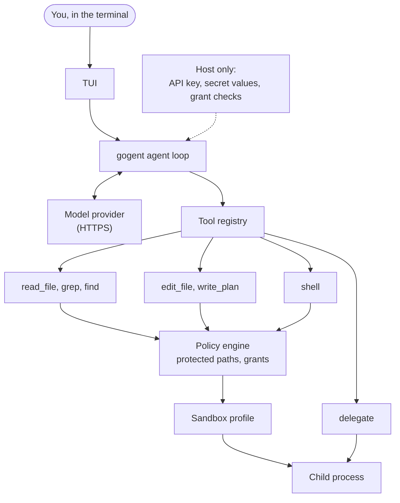
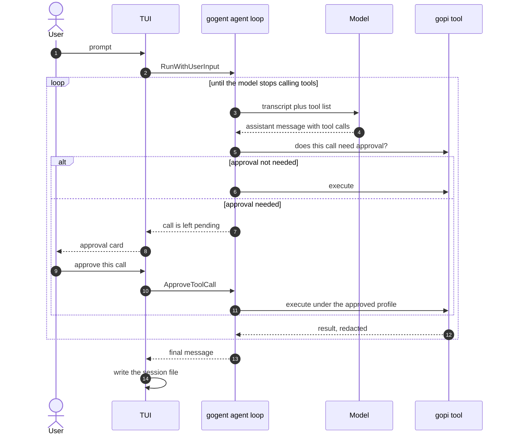
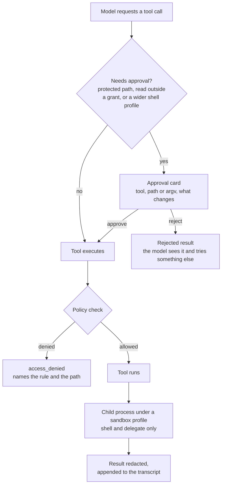

# How gopi works

gopi is one host process. That process holds your API key, the conversation, and
the policy that decides what a tool may touch. The model runs elsewhere, but
everything the model asks for is executed here, by a tool, in a child process
that can reach only what the sandbox allows.

This page is the map. Each layer it names has its own page, linked at the end.

## The pieces

The conversation loop is [gogent](https://github.com/cgund98/gogent). gopi owns
everything the loop calls into: the system prompt, the tools, the policy, the
sandbox, and the secrets.

Everything to the left of the model stays in the process. The model never sees a
secret value, a protected file, or a path the policy did not clear.

## One turn

A turn starts when you press Enter at the composer. The TUI calls
`RunWithUserInput`, and the loop alternates between model replies and tool calls
until the model stops asking for tools.

The loop ends on a model turn with no tool calls. Tool results, not the model's
confidence, are what the transcript accumulates.

## What stops a tool call

Three gates can stop a call before it does anything: the approval check, the
policy check inside the tool, and the sandbox around the child process.

The approval gate is not a security boundary on its own. It is a check inside a
tool, and a check can be routed around by a different tool. The sandbox is what
still holds after the spawn, which is why the same protected paths that make
`read_file` pause are also deny rules in the `shell` profile.

A `delegate` child is the exception: it never pauses. Its tool set is a subset of
the parent's, and a call it would have to pause for fails with `access_denied`
instead. See [Subagents](subagents.md).

## The four layers

Each layer answers a different question, and each one assumes the layer above it
failed.

| Layer | What it decides | Where it lives |
|-------|-----------------|----------------|
| Instructions | What the model is told to do | System prompt, `AGENTS.md`, skills |
| Tool policy | Whether this call may run, and whether a person must approve it | The tools themselves, backed by the policy engine |
| Sandbox | What a process can touch once it is running | Seatbelt, on macOS; fail closed elsewhere |
| Secrets | Which credentials exist, and that the model never sees their values | The host process only |

Instructions are not a boundary. A repository's `AGENTS.md` is untrusted text: it
can ask for anything, and the layers below it decide. See
[Instructions](instructions.md) and [Security model](security-model.md).

## The host is the trust root

The host process is not sandboxed. It reads the config, holds the secret values,
and computes each profile. The child gets a scrubbed environment and a profile for
that one call, and it cannot widen either.

Two things follow:

- Nothing the model reads grants a capability. File contents, web pages, tool
  output, skills, and `AGENTS.md` inside a repository are data.
- A wider profile is a fresh approval card, every time. Approval is per call, not
  per session, so a prompt-injected model cannot reuse yesterday's yes.

## Modes

Modes change which tools the registry exposes, not how a call is executed:

| Mode | What it can do |
|------|----------------|
| Agent | Read, edit, run shell commands, use the web, and `delegate` |
| Ask | Read the workspace and the web |
| Plan | Read, run shell commands, and write a plan with `write_plan` |

Switch with `/agent`, `/ask`, `/plan`, or `/mode <name>`. See
[Slash commands](../reference/slash-commands.md).

## Where state lives

Transcripts are in memory while a run is in progress and written to
`~/.gopi/sessions/<id>.json` when it finishes, along with read grants and review
baselines. Workspace trust is separate, in `~/.gopi/trust.json`. Secret values are
read from `~/.gopi/secrets.toml` at startup and stay in the broker.

See [File locations](../reference/file-locations.md).

## Related

- [Sandboxing](sandboxing.md) — the profile, the protected paths, and the
  network modes.
- [Permissions and approval](permissions-and-approval.md) — the per-call gate.
- [Secrets](secrets.md) — the broker and redaction.
- [Instructions](instructions.md) — how the system prompt is assembled.
- [Subagents](subagents.md) — the child policy.
