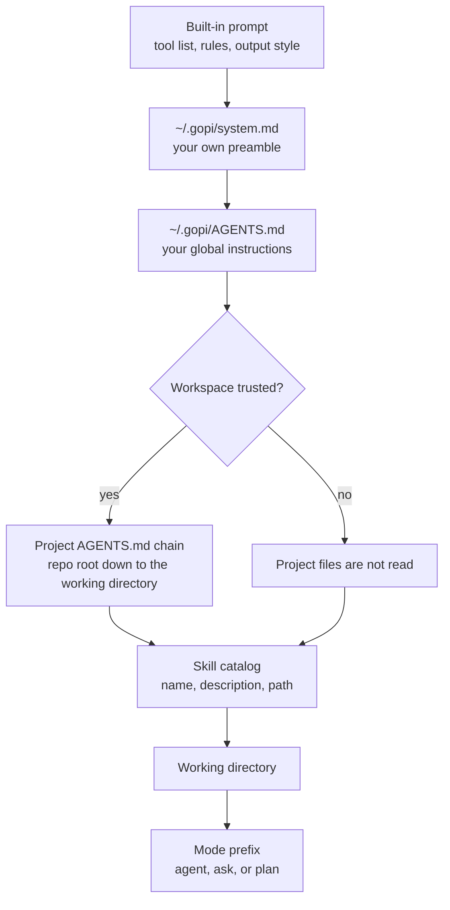

# Instructions

The system prompt is the standing context for every turn. gopi assembles it from
several files and sends it to the model, separately from the transcript, so it is
not something you can edit by replying in the chat.

The assembly order goes from general to specific. Later blocks are more local, and
more local wins.



Every piece is optional except the built-in prompt, which ships with the binary.
The mode prefix is appended last, so the active mode can narrow what the others
allow.

## What each source is

| Source | Path | Loaded |
|--------|------|--------|
| Built-in prompt | compiled into the binary | Always |
| Your prompt | `~/.gopi/system.md` | If present |
| Global instructions | `~/.gopi/AGENTS.md` | If present |
| Project instructions | `AGENTS.md` on the path from the repo root to the working directory | Only in a trusted workspace |
| Skill catalog | `~/.gopi/skills`, `skill_dirs`, and the project's `.gopi/skills` | Catalog always; see [Skills](skills.md) |

`system.md` is added to the built-in prompt, it does not replace it. That keeps
the tool contract in place even when you write your own preamble.

## The project chain

Inside a trusted workspace, gopi walks from the repository root down to your
working directory and reads an instructions file at each level:

- The repo root first, the working directory last, so the closest file overrides
  the ones above it.
- `AGENTS.override.md` in a directory replaces `AGENTS.md` in that directory only.
- The repo root is the nearest directory above the workspace that has a `.git`.

A monorepo can therefore put shared rules at the root and a package's own rules
next to the code, without copying either.

`instructions.fallback_files` adds extra filenames beside `AGENTS.md`, such as
`CLAUDE.md`. It is empty by default, so a file named for another tool is not read
unless you ask for it:

```toml
[instructions]
fallback_files = ["CLAUDE.md"]
```

## Trust

Project files are read only after you trust the workspace. The first time you open
a directory, gopi asks once, and the answer is stored in `~/.gopi/trust.json`
under the canonical path of the repo root, not inside the repo.

- **Trusted** — project instructions and skills load, and edits are allowed.
- **Untrusted** — project instructions and skills are not read, and edits are
  refused.

A cloned repository is untrusted until you answer. Trust can be revoked by editing
that file.

## The byte budget

Each block is capped by `instructions.project_doc_max_bytes`, which defaults to
32 KiB. When a block is over budget, gopi keeps the **end** of it and prefixes a
`[earlier instructions truncated]` marker.

Keeping the tail is deliberate: the project chain is concatenated root-first, so
the most local file is last. A short truncation drops distant context rather than
the file you most expect to apply.

## Instructions are not configuration

An instruction file is text for the model. It cannot change what a tool is allowed
to do:

- It cannot widen the sandbox, remove a protected path, or pre-approve a call.
- It cannot add tools or grant itself filesystem roots.
- A repository's `AGENTS.md` is untrusted content. So is a skill body, a web
  page, and tool output.

The built-in prompt says this outright, and the enforcement does not depend on the
model believing it: the layers that decide are the tool and the sandbox. See
[Security model](security-model.md).

## Where it is set

gopi passes the assembled text to the provider client's system-prompt field when
it builds the model. Switching modes rebuilds the model with the same base prompt
plus that mode's prefix, and the prompt is rebuilt when the trust decision
changes. See [How gopi works](how-gopi-works.md).

## Related

- [Skills](skills.md) — the catalog and what a body costs.
- [Permissions and approval](permissions-and-approval.md) — why instructions
  cannot lower the bar.
- [Security model](security-model.md) — the model is untrusted.
- [Configuration](../reference/configuration.md) — the `[instructions]` table.
