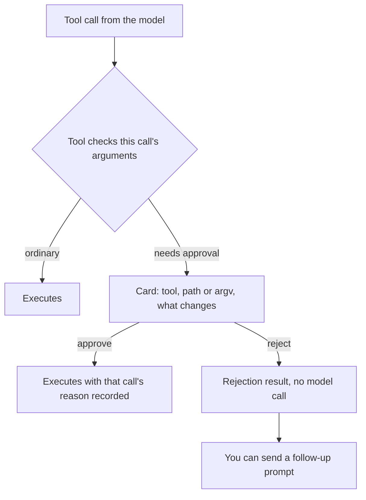
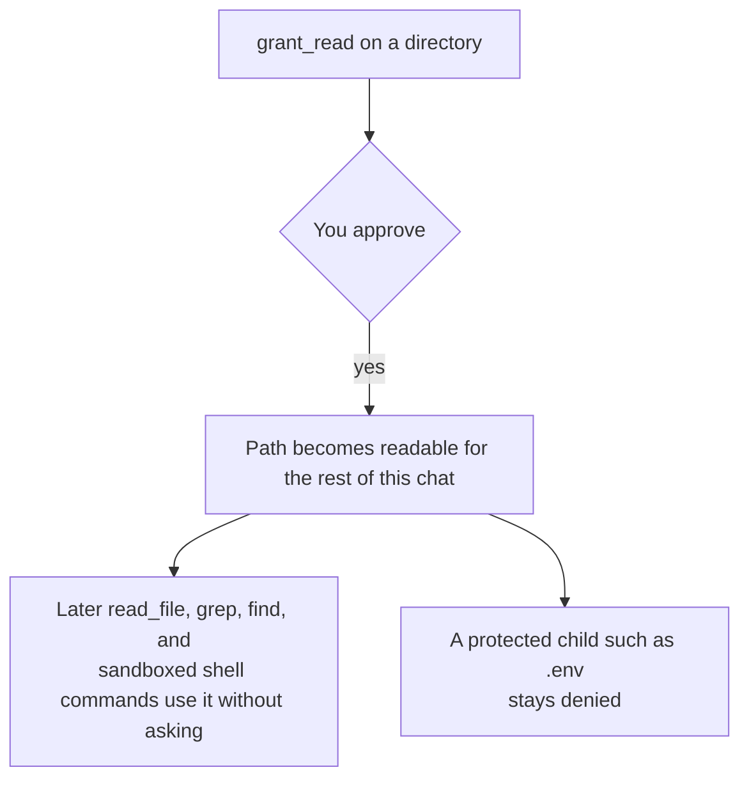

# Permissions and approval

Most tool calls run on their own. The ones that would touch something you did not
put in the workspace, or that would leave the sandbox, stop and ask you first.

This page is how that decision is made, what the card shows you, and what
approval does and does not cover.

## The default

The default is generous with reads and narrow with everything else:

- Reading and searching inside the workspace runs without asking.
- Every `shell` command is sandboxed and runs without asking, as long as it needs
  nothing beyond the default profile: the workspace as a write root, no network,
  and protected paths denied.
- Editing a file inside the workspace runs without asking.
- Reaching outside the workspace, touching a protected path, or widening the
  sandbox pauses for an approval card.

That split is deliberate. The sandbox already bounds an ordinary command, so
prompting for every one of them would train you to approve without reading. The
calls that come with a card are the ones where the sandbox is about to be weaker
than usual.

## How the decision is made

The model's requested call is passed to the tool, and the tool decides. Nothing
about the model's intent is trusted, and there is no session-wide override.

Three properties matter here:

- **It sees this call, not just the tool.** A tool that takes something like a
  path or a command can ask for approval based on the actual argument, so the same
  tool runs freely in one call and pauses in the next.
- **It is per call.** Approval is remembered for that call only. The next
  identical request asks again.
- **It runs while the call is still pending and has no side effects.** A tool that
  fails to say "this needs approval" does not get approval by accident.

## What makes a call pause

| What the call would do | Example card reason |
|------------------------|---------------------|
| Read a protected path | `Protected path **/.env: .env` |
| Read outside the workspace | `Path is outside the workspace: /etc/hosts` |
| Write a protected path, or write outside the write root | `Protected path **/.env: .env` |
| Run a command with a wider profile | `Profile: sandbox -> unsandboxed` |
| Read or write extra paths from a command | `Elevated file access: read /Users/you/notes` |
| Reach the network from a command | `Network: proxy.golang.org` |
| Run a command with unrestricted network | `Network: deny -> unrestricted` |
| Grant read access to a path | The resolved path |

A command that stays inside the default profile and does not name extra paths or
hosts produces no card. That is the common case, and it is why the sandbox exists:
it makes the ordinary command safe to run unattended.

The `web_search` and `web_fetch` tools do not pause. They resolve the host and
refuse private, loopback, and cloud metadata addresses in the host, so a fetch
cannot be aimed at a local service.

## The card

The card shows the tool, what it will actually do, and what changes. For `shell`
it shows the command, the working directory, and the profile delta, not a summary
written by the model. A model that has been prompt-injected can ask for an
elevated command, but it cannot dress the request up: you see the argv you would
type yourself.

Keys: `↑`/`↓` and Enter, or `y` to approve and `n` to reject.

If several calls are pending, they are queued, and you answer them one at a time.
Rejecting appends a rejection result the model can see, so it can try something
narrower instead of being stuck.

## Read grants

Approving every individual read outside the workspace gets tedious, so there is a
way to open a path for the rest of the chat: the `grant_read` tool, and the
`/allowpath <path>` command.

Three limits keep this from being a blanket yes:

- **Read only.** Writes and unsandboxed commands still ask every time.
- **Not a protected path.** A grant for a directory does not open an `.env` or a
  `.gopi` inside it. Those need their own approval, and the reason says which rule
  matched.
- **Not inherited.** A subagent does not receive new grants. It can read a
  directory you already granted this chat, but it has no way to ask for another.

Grants are stored with the session, so resuming a chat brings them back.

## Elevation

Elevation is a `shell` call that asks for more than the default. There are three
ways to widen a command, and they combine:

| Ask | Grants | Still withheld |
|-----|--------|----------------|
| `read_paths` | Read of the named paths, canonicalized and shown | Protected paths, unless each is also approved |
| `write_paths` | Write of the named paths | Everything outside them, and the protected floor |
| `network_hosts` | The named hosts, through the proxy | Other hosts, and private and metadata addresses |
| `network: unrestricted` | All outbound network for that command | Protected files and secret values |
| `profile: unsandboxed` | Your uid, no sandbox at all | Protected files, `.git` hooks, and secret values |

Two rules hold across all of them:

- **Approval does not carry over.** Approving a widened call approves that call.
  The next one is a new card.
- **The environment stays scrubbed.** Even an unsandboxed command does not receive
  a value from the secret store. The one addition is `HOME`, so your tooling finds
  its own config.

Prefer the narrowest ask that works. To reach a registry or a git host, prefer
adding the host to the allowlist over `network: unrestricted`; see
[Configure network access](../guides/configure-network.md).

## Subagents

A subagent never raises a card, because a card would have to go to the parent
model rather than to you. Instead, a child call that would need approval fails with
`access_denied` and the reason, and the child has to work within its sandbox. See
[Subagents](subagents.md).

## What is not an approval

- **Approval is not a security boundary on its own.** It is a check inside a tool,
  and a check can be routed around by another tool. The rule that still holds after
  the call is the sandbox profile. That is why the same protected path both pauses
  a file tool and appears as a deny rule in the shell profile. See
  [Sandboxing](sandboxing.md).
- **A project file cannot lower the bar.** An `AGENTS.md` or a project config can
  narrow what gopi does. It cannot remove a protected path or pre-approve a
  command.
- **Replying to the model is not approving.** Typing "yes, run it" at the composer
  is an ordinary prompt. The only thing that runs a pending elevated call is the
  card.

## Related

- [Sandboxing](sandboxing.md#protected-paths) — the security floor and ignore
  rules behind most cards.
- [Sandboxing](sandboxing.md) — what a command can touch once it runs.
- [Secrets](secrets.md) — values that approval does not expose.
- [Subagents](subagents.md) — why a child fails closed instead of pausing.
- [How gopi works](how-gopi-works.md) — the gates in one turn.
