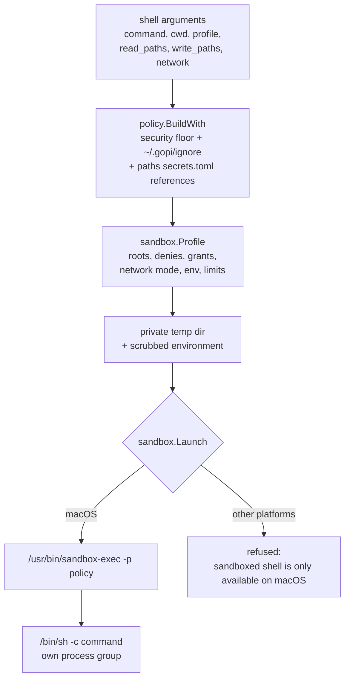
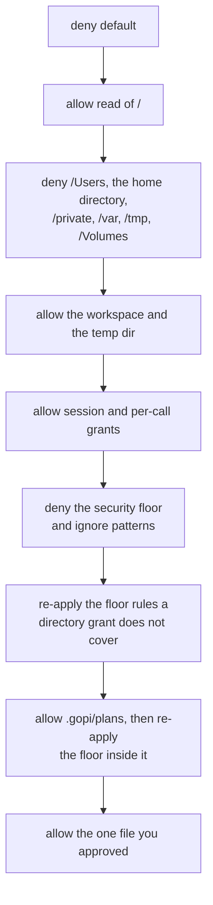

# Sandboxing

A sandboxed command runs under a profile the host computes for that one call. The
profile lists what the command may read, write, and reach, and the operating system
enforces it. The child cannot widen the profile, and neither can the model.

Sandboxing is the layer that still holds after a tool has decided to run. See
[How gopi works](how-gopi-works.md) for where it sits among the others.

## Why it exists

A policy check inside a tool decides whether *that tool* may touch a path. It
cannot decide for the whole process. If `read_file` refuses `.env` and nothing
else changes, the model can ask `shell` to `cat` the same file.

So the same deny set feeds two places: the check inside the file tools, and the
profile the OS enforces around a shell command. The check gives the model a clean
error. The OS rule is the part that cannot be argued with.

That split is deliberate, and it is the same one Codex and Claude Code use. Rules
that only guard a built-in file tool leave the terminal free to `cat` the same
path; the restriction has to cover the whole process tree to mean anything.

## What gets sandboxed

The sandbox wraps a child process, so it applies to the tools that spawn one:

| Tool | Sandboxed |
|------|-----------|
| `shell` | Yes. Every command runs as a child under a profile. |
| `explore` | Indirectly. Its `grep` runs the ripgrep binary under a profile when ripgrep is available. |
| `delegate` | Yes, indirectly. The child agent's `shell` calls are sandboxed the same way. |
| `read_file`, `grep`, `find`, `edit_file` | No process. These run in the host and check the shared rule set before they open a path. The walker `grep` is the fallback when ripgrep is not available. |
| `web_search`, `web_fetch`, `tasks`, `write_plan` | No process, and no filesystem access to protect. |

The ripgrep search runs read-only under the same profile `shell` uses: the
workspace is the only read root, the network is denied, and the ripgrep binary's
own directory is opened as an extra read so a binary under a denied prefix such
as `/Users` is reachable. Every match is re-checked against the shared rule set
afterwards, so a protected file is dropped and reported in `denied` even if the
profile somehow allowed it. See [Tools](../reference/tools.md#grep).

The host process itself is not sandboxed. It holds your API key, the secret
values, and the policy, and it computes each profile. It is the trust root.

## Building the profile

`shell` turns its arguments into a `sandbox.Profile` and hands it to a launcher.
That is the whole path from a model request to a constrained process.



A `Profile` is a plain value, built in the host:

| Field | Meaning |
|-------|---------|
| `ReadRoots` / `WriteRoots` | Directories the command may read, and may read and write. |
| `DenyRead` / `DenyWrite` | Regexes for protected paths. |
| `SessionReads` / `ExtraReads` / `ExtraWrites` | Paths granted this session, and paths approved for one call. |
| `Network` | `deny`, `allowlist`, or `unrestricted`. |
| `ProxyPorts` | Loopback proxy ports, when the network mode is `allowlist`. |
| `Env` | The exact environment the child receives. |
| `Timeout` / `OutputLimit` | Bounds on wall-clock time and captured output. |
| `Argv` / `WorkDir` | The command and its working directory. |

The default write root is the trusted workspace. Reads outside it are limited to
what a compiler or interpreter needs to run, so working in a directory never
implies that the rest of your home directory is readable.

## macOS: Seatbelt

The launcher renders the profile to Seatbelt policy and runs the command under
`/usr/bin/sandbox-exec -p <policy>`. The policy starts by denying everything, then
carves back the minimum:

- **Read** of the workspace, the private temp dir, and the system paths a shell
  and a toolchain need. Reading everything outside the denied directories below is
  allowed, which covers `/usr`, `/bin`, `/System`, and `/opt/homebrew`.
- **Write** of the workspace write root and the private temp dir only.
- `/dev/null` for read and write, and the system CA bundle, which would otherwise
  be caught by the `*.pem` rule.
- The loopback proxy port, when the network mode is `allowlist`.
- Nothing else: outbound network, reading another process's information, and
  Apple events that would drive other apps are all denied.

Then it denies, in this order:

- `/Users`, your home directory, `/private`, `/var`, `/tmp`, and `/Volumes`.
  Denying the home directory here is what keeps `~/.ssh` and `~/.aws` out of
  reach even though the workspace read root sits inside it.
- Every pattern from the security floor and your ignore files: `.env` and friends,
  key and certificate files, `~/.gopi`, `~/.ssh`, `~/.aws`, `~/.kube`, `~/.gnupg`,
  the keychains, `.git/config`, `.git/hooks`, and the gopi binary itself.
- Any pattern from `~/.gopi/ignore`, provided it can be translated.
- Any pattern from the repo's `.gitignore` or `.git/info/exclude`, but only when
  `respect_gitignore` is on.

Seatbelt decides by the last matching rule, so the order matters. A session grant
for a directory is allowed, then the floor rules it does not cover are applied
again, so the grant cannot quietly open an `.env` inside it. `<workspace>/.gopi/plans`
is opened the same way, after every floor rule. Only a path you approved for one
call is allowed after that, which is how a single approved `.env` stays readable
while its neighbors do not.



A command gets its own temp directory, not a shared `/tmp`. It cannot rendezvous
with an unsandboxed process through a temp file.

## Protected paths

A protected path stays unreadable and unwritable until you approve that one call.
The deny set is the union of the security floor, your global ignore file, and —
when you turn it on — the repository's ignore files. It feeds two places: the
check inside the file tools, and the profile above.

**The security floor** is compiled into gopi and cannot be turned off:

| Group | Paths |
|-------|-------|
| gopi itself | `~/.gopi`, `<workspace>/.gopi`, and every file `secrets.toml` references |
| Credentials | `~/.ssh`, `~/.aws`, `~/.kube`, `~/.gnupg`, `~/Library/Keychains` |
| Secret-looking files | `.env`, `.env.*`, `*.pem`, `*.key`, `id_rsa`, `id_ed25519`, `credentials.json`, `secrets.json` |

One directory is carved out of the floor. Plans are agent-authored markdown, not
configuration and not a secret, so gopi treats them as ordinary workspace content:

| Path | Read | Write |
|------|------|-------|
| `<workspace>/.gopi/plans` | Open | Open |
| The rest of `<workspace>/.gopi` | Protected | Protected |
| A nested `.gopi`, such as `scratch/demo/.gopi` | Protected | Protected |

The waiver reaches no further than the `.gopi` rule it was carved from: a `.env`,
a `*.pem`, or an `id_rsa` inside `.gopi/plans` is still protected. A nested `.gopi`
belongs to some other project and stays shut.

**Your global ignore file** is `~/.gopi/ignore`, in gitignore syntax, and it is
always applied. **Repo rules** — `.gitignore` and `.git/info/exclude` — are applied
only when `[sandbox] respect_gitignore` is `true`:

```toml
[sandbox]
respect_gitignore = true
```

The default is off, because a `.gitignore` answers "what does git track?", not
"what may the agent read?". A build output, a cache, or a scratch directory is
usually listed there, and treating those as protected means an approval card on
every visit. Turn the key on when the repository's ignore file also marks things
you want the agent to keep away from.

An opt-in repo may protect more files than the floor. It may never protect fewer:

- **Negation cannot re-include a floor path.** A `.gitignore` line like `!.env`
  does not make `.env` readable; the floor wins.
- **Some paths stay write-protected even in a writable workspace**:
  `.git/config`, `.git/hooks`, `.git/info/attributes`, `.gitignore`,
  `.git/info/exclude`, `.gopi`, and the gopi binary. A sandboxed command cannot
  plant a `pre-commit` hook for later or rewrite the ignore files. The one
  exception is `<workspace>/.gopi/plans`, which is open for writing.

Two details matter for matching:

- **Case is folded.** A deny on `.env` also covers `.ENV`, because APFS often is
  case-insensitive.
- **Paths are canonicalized before either check.** Symlinks are resolved and `..`
  is rejected, and `/tmp` and `/private/tmp` are treated as one directory, so a
  symlink inside the workspace is not an alias for a protected target.

An ignore pattern that cannot be translated into a sandbox rule fails the build of
the whole rule set, which refuses the command rather than running it with a hole.
See [Fail closed](#fail-closed).

## The environment is scrubbed

The child does not inherit your environment. It gets exactly this, and nothing
else:

```text
PATH=/usr/bin:/bin:/usr/sbin:/sbin:/opt/homebrew/bin
TMPDIR=<private temp dir>
TMP=<private temp dir>
TEMP=<private temp dir>
LANG=C
LC_ALL=C
```

There is no `HOME` here, no `SSH_AUTH_SOCK`, and no provider key. Injection
variables like `DYLD_INSERT_LIBRARIES` are never copied from the parent, so a
command cannot preload code into another process. An unsandboxed command is the
one exception: because it runs with your uid, it also receives `HOME`, so your
tooling still finds its own config.

When the network mode is `allowlist`, the child also gets `HTTP_PROXY`,
`HTTPS_PROXY`, and `ALL_PROXY`, all pointed at `127.0.0.1`, with `NO_PROXY`
cleared.

## Network

| Mode | What the child can reach |
|------|--------------------------|
| `deny` (default) | Nothing. No sockets, and no DNS to resolve through. |
| `allowlist` | Only the hosts allowed in your config, through a loopback proxy the host runs. |
| `unrestricted` | Everything, for that one command, after you approve it. |

Seatbelt can block destinations but cannot filter by hostname, so the host runs a
local HTTP and SOCKS5 proxy and denies every other outbound address. A client that
ignores the proxy variables fails closed rather than reaching the network
directly. The proxy dials a host only when it is allowlisted and every address it
resolves to is public: loopback, private, link-local, CGNAT, multicast, and the
cloud metadata addresses stay blocked even for an allowlisted name. A hostname
under `deny` beats the same name under `allow`. For configuration, see
[Configure network access](../guides/configure-network.md).

## Bounds

Every child is bounded, so no single command can hang the session or fill the
context window:

- **Timeout** — 30 seconds by default. On expiry the whole process group is
  killed, not just the shell.
- **Output** — 64 KiB per stream, then the rest is discarded and the result is
  marked `truncated`.
- **Process group** — the child leads its own group, so a fork bomb or a stray
  background process dies with it.

Cancelling the TUI interrupts the same group and returns an `execution_failed`
result. It does not silently retry outside the sandbox.

## Fail closed

If the sandbox cannot be applied as asked, the command does not run. There is no
warning-and-continue path, because that path is the bypass.

- **Off macOS**, a sandboxed command is refused with `access_denied`. Linux and
  Windows are not supported for `shell` today; `profile: unsandboxed` still runs
  after approval.
- **An ignore pattern that cannot be translated** to a Seatbelt rule fails
  `policy.BuildWith`, so the command is refused rather than run with a hole in the
  policy. This covers `~/.gopi/ignore`, and a repo ignore file when
  `respect_gitignore` is on.
- **`allowlist` without a proxy port** is an error, not a silent downgrade.
- **An unknown network mode** is an error.

When a command is refused, the model can ask again with a wider profile or with
`read_paths` or `write_paths`. That call is a new approval card. It is never a
retry of the refused one.

## Related

- [Permissions and approval](permissions-and-approval.md) — the per-call gate and
  the elevated profiles.
- [Configure network access](../guides/configure-network.md) — allowlist, deny,
  and per-call elevation.
- [Secrets](secrets.md) — what never enters the environment.
- [How gopi works](how-gopi-works.md) — where the sandbox sits in a turn.
