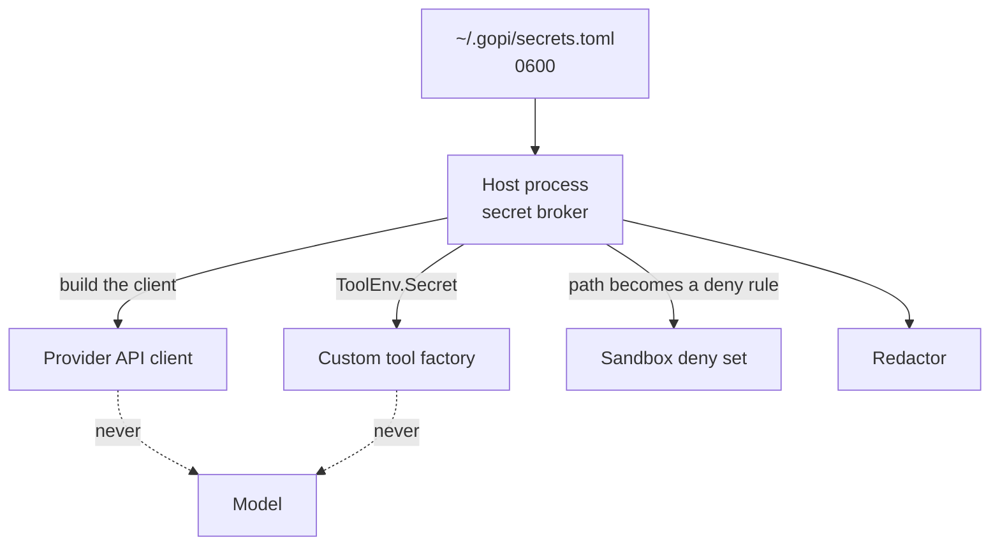

# Secrets

A credential is read by the host process and used there. The model is told which
credentials exist; it is not given their values.

## The file

Credentials live in `~/.gopi/secrets.toml`:

```toml
deepseek_api_key = "sk-..."
search_api_key = "..."
```

The directory must be mode `0700` and the file mode `0600`. gopi refuses to start
otherwise, rather than run with a readable key store.

An entry is either a string or a reference to a file:

```toml
github_token = { file = "~/.config/gh/token" }
```

A referenced file must be absolute or start with `~/`, and must itself be mode
`0600`. Its canonical path is remembered, so a file-backed secret can be written
back to by a tool that refreshes it.

The built-in wiring reads four names: `openai_api_key`, `kimi_api_key`,
`deepseek_api_key`, and `search_api_key`. Custom tools can read any name through
the tool factory, and the same redaction applies to it.

## Precedence

A value in `secrets.toml` beats the matching environment variable. So
`OPENAI_API_KEY` in your shell works, but the file wins when both are set, which
lets you keep a project-specific key without exporting it everywhere. gopi also
reads a `.env` or `.env.local` in the current directory if one exists.

## Where a value goes



- **The provider key** is passed to the client builder in the host. It is not a
  tool argument, a prompt field, or a log line.
- **A custom tool's secret** is read at startup through the tool factory and stays
  in that factory.
- **A file-backed secret's path** becomes a policy rule that denies read and write
  of that file. File tools need approval to open it, and the shell sandbox denies
  it, including for a `delegate` child.
- **No value enters a child process.** The shell environment is scrubbed and never
  contains a broker value.

## Redaction

Redaction runs on every tool result before it reaches the transcript, and on text
shown in the UI. It replaces:

- Any value currently loaded in the broker.
- Credential fields inside a JSON value — keys containing `token`, `secret`,
  `key`, or `password`. This catches the individual fields of an OAuth token
  file, not just the whole blob.
- Common token shapes: `sk-` prefixes, `github_pat_`, `AKIA`, and PEM private key
  blocks.

Redaction is a backstop for an accidental echo. It is not the primary control —
the primary control is that the child environment does not contain the values in
the first place, so there is nothing to echo.

The composer does not interpolate `secrets.toml` into what you send. Pasting a
high-entropy token that matches the redactor raises a confirmation before the
message is sent, so a key you paste by accident is not committed to the
transcript in the clear.

Two limits are worth knowing:

- **An approved read can still put a secret in the transcript.** If you approve
  reading a key file, its contents enter the conversation. The card tells you
  before you approve.
- **Redaction matches known values, not meaning.** A secret that was never loaded
  from `secrets.toml` and does not match a known shape, such as a password living
  in a file you approved, is not caught.

## Related

- [Sandboxing](sandboxing.md) — the scrubbed environment and the deny set.
- [Permissions and approval](permissions-and-approval.md) — approving a protected
  read.
- [Security model](security-model.md) — why secrets stay in the host.
- [Manage secrets](../guides/manage-secrets.md) — a worked example.
- [Environment variables](../reference/environment-variables.md) — names and
  precedence.
