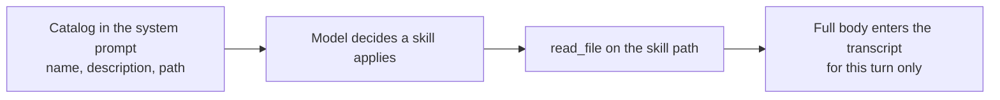

# Skills

A skill is a directory holding a `SKILL.md` file. It is a way to keep a procedure
you repeat — how to run the tests, how to cut a release — where the model can
load it when it is relevant, without paying for it on every turn.

## Shape

```text
~/.gopi/skills/
  go-tests/
    SKILL.md
    scripts/run.sh
```

`SKILL.md` starts with YAML frontmatter, then the body:

```markdown
---
name: go-tests
description: Run and interpret Go tests in this module.
---

Run `make test` for the packages you touch. Read a failure before fixing it...
```

`name` and `description` are required. A file without both is skipped, not
reported, so a half-written skill does not break the session. The body is ordinary
markdown. Optional files beside `SKILL.md`, such as a script, are just files.

## Where skills are found

| Scope | Path |
|-------|------|
| User | `~/.gopi/skills/<name>/SKILL.md` |
| Extra | Each directory in `instructions.skill_dirs` |
| Project | `<workspace>/.gopi/skills/<name>/SKILL.md` |

Roots are searched in that order. When two skills share a name, the later root
wins, so a project skill can override a global one with the same name. Project
skills are searched only in a trusted workspace.

To add a skill, create the directory and restart gopi. The catalog is built at
startup.

## The catalog is short on purpose

The system prompt lists each skill by name, description, and path. It does not
contain the body.



Two things follow:

- A large library costs a few lines per turn, not a context window. Only the
  skills actually used load their bodies.
- A skill body costs nothing until it is needed. Splitting a long procedure into
  several focused skills is usually better than one large one.

The skill roots are added to the chat's read grants when the session starts, so
reading a body does not raise an approval card.

## A skill is not a plugin

- It adds no tools. The model still has only the tools in the active mode.
- It grants no filesystem roots. The skill's own directory is readable; nothing
  else is opened.
- It cannot change the sandbox or the protected paths.

A script that ships with a skill runs the same way any other command does: through
`shell`, under the sandbox profile, with protected paths denied and network
denied. A skill that says "run this installer" gets the same treatment as any
other installer.

## Untrusted content

A skill body is data, exactly like a file, a web page, or tool output. A project
skill comes from a repository, so it is untrusted until you trust the workspace,
and even then it ranks below the enforcement:

- It cannot widen the sandbox or approve anything.
- It cannot turn off the protected paths or the network rules.

A repository that ships a `.gopi/skills/` directory full of confident instructions
gets no more authority than one that ships an `AGENTS.md` file. See
[Security model](security-model.md) and [Instructions](instructions.md).

## Related

- [Instructions](instructions.md) — where the catalog is placed in the prompt.
- [Security model](security-model.md) — the model is untrusted.
- [Write a skill](../guides/write-a-skill.md) — a worked example.
- [Configuration](../reference/configuration.md) — `skill_dirs`.
