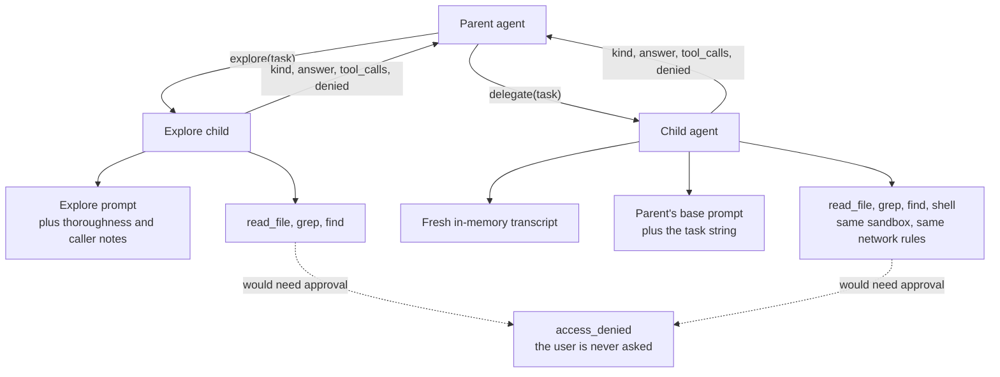

# Subagents

`explore` and `delegate` each hand a bounded task to a second agent and return
only its answer. They exist to keep bulk out of your transcript: a search that
touches forty files costs one tool call, not forty file bodies.

Both children are weaker than their parent. They read, search, and — for
`delegate` — run sandboxed commands. Neither can edit, and neither can ask you
for anything.

## Two subagents

| | `explore` | `delegate` |
|---|---|---|
| Tools | `read_file`, `grep`, `find` | `read_file`, `grep`, `find`, `shell` |
| Prompt | Its own, replaceable with `~/.gopi/explore.md` | The parent's base prompt |
| Model | `[models] explore`, else the active mode's model | The active mode's model |
| Turns / time / calls | 40 / 2 minutes / 6 per session | 50 / 2 minutes / 4 per session |
| Use for | Finding, mapping, answering "how does X work" | Anything that has to run a command |

`explore` deliberately has no `shell`, which is the one place it diverges from
OpenCode's explore subagent. Everything that makes exploration noisy is a file
body a search returned; a command's output is `delegate`'s problem, and keeping
`shell` out of `explore` is what makes the tool safe to reach for casually.

## What a child gets

- **A fresh transcript.** The child starts with the task string and nothing else
  from your chat.
- **Its own prompt.** `explore` gets a search-specialist prompt; `delegate` gets
  the parent's base prompt, without the parent's mode prefix.
- **A reduced tool registry.** No `edit_file`, no nested subagent, no web tools,
  no plan, no task list.
- **No new grants.** A child reads through the read grants this chat already has
  and cannot add to them.

## The child never pauses

An approval card is a question for you, and a subagent has no line to you. If a
child call would need approval, it fails instead:

- The child's tools are wrapped so that they never report "needs approval".
- If such a call is attempted anyway, it returns `access_denied` with the reason,
  and the child keeps working within its limits.

So the child cannot read a protected path, cannot reach outside the workspace, and
cannot widen the sandbox. The parent's prompt tells the model to call `grant_read`
before delegating work outside the workspace, because that grant is the only way
the child will see such a path — and even then the child cannot add grants of its
own.

## What the parent sees

The tool result carries four fields:

| Field | Meaning |
|-------|---------|
| `kind` | `explore` or `subagent`, so the caller knows which child ran. |
| `answer` | The child's last message that made no tool calls. |
| `tool_calls` | How many tool calls the child made. |
| `denied` | Summaries of whatever the child was refused. |

The parent does not see the child's transcript, raw file bodies, or command
output. While a child runs, its tool calls are streamed to the UI so you can
watch progress without waiting for the answer. An `explore` card is colored
differently from a normal tool card and its busy line counts searches rather than
tool calls.

## Bounds

Every child is capped, so one call cannot run away:

| Limit | `delegate` | `explore` |
|-------|-----------|-----------|
| Model turns | 50 | 40 |
| Wall-clock time | 2 minutes | 2 minutes |
| Calls per session | 4 | 6 |

The explore caps come from `[subagents]` in `config.toml`. Only one level is
possible: neither child's registry has a subagent tool, so a child cannot start
another. When a budget is spent, the tool returns `delegate_limit` or
`explore_limit` and the parent has to do the work itself.

## Treat the answer as a claim

A child's answer arrives in the parent transcript as tool output, and tool output
is data. A child that read a poisoned file can repeat what the file said. The
blast radius is limited — neither child had an edit tool and the delegate shell
was sandboxed — but the parent should verify a factual claim before acting on it.
That is what the parent prompt asks for.

## When to use which

Good fit for `explore`: locate an implementation, map a feature, answer "how does
X work", find every place a name is used.

Good fit for `delegate`: run the tests and report what failed, inspect a
dependency with a command, do more than one kind of work.

Poor fit for either: a single file read, any edit, or anything that needs access
you have not already granted this chat.

## Related

- [Permissions and approval](permissions-and-approval.md) — why a child fails
  closed instead of pausing.
- [Sandboxing](sandboxing.md) — the profile the child's shell runs under.
- [How gopi works](how-gopi-works.md) — where `delegate` sits in a turn.
