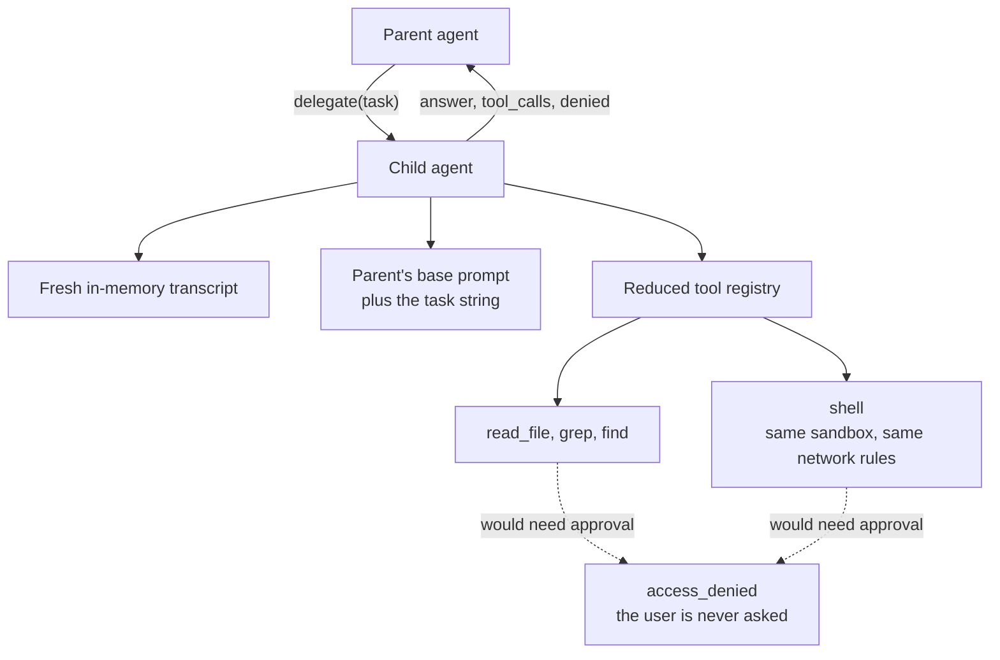

# Subagents

`delegate` hands a bounded investigation to a second agent and returns only its
answer. It exists to keep bulk out of your transcript: a search that touches forty
files costs one tool call, not forty file bodies.

The child is weaker than the parent in every direction. It reads, searches, and
runs sandboxed commands. It cannot edit, and it cannot ask you for anything.

## What the child gets

- **A fresh transcript.** The child starts with the task string and nothing else
  from your chat.
- **The parent's base prompt.** Same instructions and skill catalog, without the
  parent's mode prefix.
- **A reduced tool registry.** `read_file`, `grep`, `find`, and `shell`. No
  `edit_file`, no `delegate`, no web tools, no plan, no task list.
- **The same model** the parent's active mode is using.

## The child never pauses

An approval card is a question for you, and a subagent has no line to you. If a
child call would need approval, it fails instead:

- The child's tools are wrapped so that they never report "needs approval".
- If such a call is attempted anyway, it returns `access_denied` with the reason,
  and the child keeps working within its limits.

So the child cannot read a protected path, cannot reach outside the workspace, and
cannot widen the sandbox. The parent's prompt tells the model to call `grant_read`
before delegating work outside the workspace, because that grant is the only way
the child will see such a path — and even then the child cannot add grants of its
own.

## What the parent sees

The tool result carries three fields:

| Field | Meaning |
|-------|---------|
| `answer` | The child's last message that made no tool calls. |
| `tool_calls` | How many tool calls the child made. |
| `denied` | Summaries of whatever the child was refused. |

The parent does not see the child's transcript, raw file bodies, or command
output. While the child runs, its tool calls are streamed to the UI so you can
watch progress without waiting for the answer.

## Bounds

Every child is capped, so one delegate call cannot run away:

| Limit | Default |
|-------|---------|
| Model turns | 50 |
| Wall-clock time | 2 minutes |
| Delegate calls per session | 4 |

Only one level is possible: the child's registry has no `delegate`, so a child
cannot start another. When the session's delegate budget is spent, the tool
returns `delegate_limit` and the parent has to do the work itself.

## Treat the answer as a claim

The child's answer arrives in the parent transcript as tool output, and tool
output is data. A child that read a poisoned file can repeat what the file said.
The blast radius is limited — the child had no edit tool and its shell was
sandboxed — but the parent should verify a factual claim before acting on it. That
is what the parent prompt asks for.

## When to use it

Good fit: locate an implementation, summarize a directory, trace a behavior across
several reads, run a command and report what it printed.

Poor fit: a single file read, any edit, or anything that needs access you have not
already granted this chat. Those are cheaper or impossible.

## Related

- [Permissions and approval](permissions-and-approval.md) — why a child fails
  closed instead of pausing.
- [Sandboxing](sandboxing.md) — the profile the child's shell runs under.
- [How gopi works](how-gopi-works.md) — where `delegate` sits in a turn.
